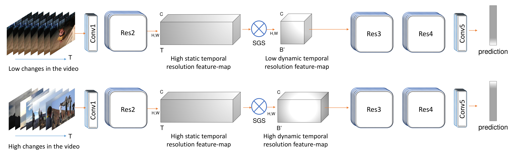

# Similarity Guided Sampling

Source code of the CVPR 2021 paper: ["3D CNNs with Adaptive Temporal Feature Resolutions"](https://arxiv.org/pdf/2011.08652.pdf).



Similarity Guided Sampling (SGS) is a differentiable module which can be plugged into existing 3D CNN architecture to reduce the computational cost (GFLOPs) while preserving the accuracy.

```latex
@inproceedings{sgs2021,
    Author    = {Mohsen Fayyaz, Emad Bahrami, Ali Diba, Mehdi Noroozi, Ehsan Adeli, Luc Van Gool, Juergen Gall},
    Title     = {{3D CNNs with Adaptive Temporal Feature Resolutions}},
    Booktitle = {{The IEEE Conference on Computer Vision and Pattern Recognition (CVPR) }},
    Year      = {2021}
}
```

## Installation

Please find installation instructions in [INSTALL.md](INSTALL.md). You may follow the instructions in [DATASET.md](sgs/datasets/DATASET.md) to prepare the datasets.

## Quick Start

Follow the example in [GETTING_STARTED.md](GETTING_STARTED.md).


## References
The code is adapted from the following repositories:

[https://github.com/facebookresearch/SlowFast](https://github.com/facebookresearch/SlowFast )

[https://github.com/kenshohara/3D-ResNets-PyTorch](https://github.com/kenshohara/3D-ResNets-PyTorch)
